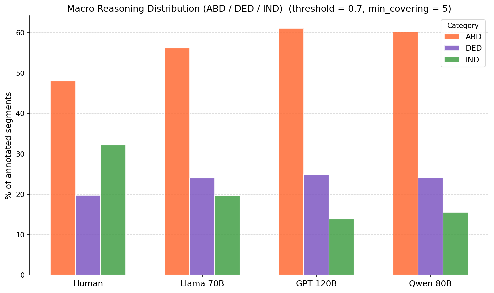
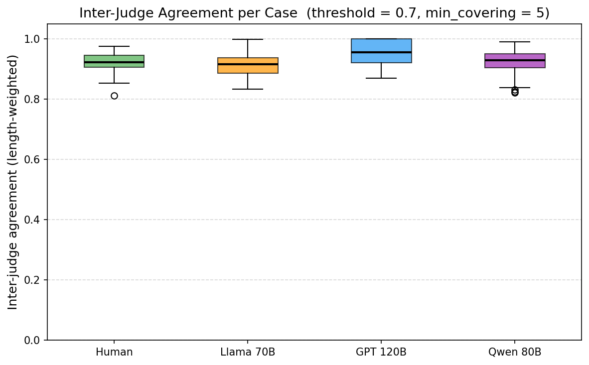
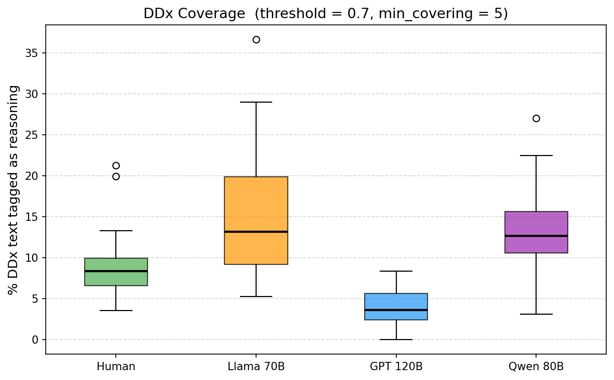

# Comparing Epistemic Reasoning in Clinical Diagnosis: Specialists vs. LLMs

**NLP for Business — USI Lugano, 2026**

---

## Overview

This report presents the results of a computational study comparing the epistemic reasoning patterns of human medical specialists with those of three state-of-the-art large language models (LLMs), applied to clinical differential diagnosis. The dataset consists of 32 complex clinical cases drawn from the *New England Journal of Medicine* Case Records (Hom et al., 2022), each containing both a physician-written differential diagnosis (DDx) and LLM-generated counterparts.

Reasoning was automatically classified into 12 subtypes across three epistemic modes — **Abduction** (hypothesis generation), **Deduction** (hypothesis testing), and **Induction** (probabilistic conclusion) — using a 15-voter majority-voting jury system, cross-validated with human review.

---

## The Three Models

Three frontier LLMs were used to generate differential diagnoses, each given only the clinical presentation and no access to the final diagnosis:

**Meta Llama 3.3 70B Instruct** is Meta's flagship open-weights instruction-tuned model. It produces flowing, conversational prose without structural divisions, resembling a continuous internal monologue. Its output is notably verbose, covering a broad surface of diagnostic hypotheses with relatively low convergence toward a leading diagnosis.

**OpenAI GPT-oss 120B** is a 120-billion-parameter model. It generates highly structured, analytical output — systematically evaluating each hypothesis with explicit "Evidence For / Evidence Against / Conclusion" sections and ranked synthesis tables. This reflects a deeply systematic, encyclopaedic approach to differential diagnosis.

**Qwen3-80B Instruct (Alibaba)** is an instruction-tuned model from Alibaba's Qwen3 family, built on a sparse Mixture-of-Experts architecture. It produces well-organised, paragraph-based reasoning that balances structure and prose — generating comprehensive DDx discussions that most closely mirror the length and register requested by the protocol (1,800–2,600 words).

These three models represent meaningfully different training philosophies and output styles, making the comparison epistemically informative beyond simple accuracy benchmarking.

---

## Methodology: From Manual to Semi-Automatic Annotation

The annotation pipeline evolved across the project. An initial phase of **fully manual annotation** was conducted by the research team, who labelled reasoning spans in a subset of cases using the 12-label taxonomy. This early work both validated the schema and produced the training signal and few-shot examples that inform the automatic jury.

Subsequently, a **15-voter jury system** (Llama 3.3 70B used as annotator LLM, with temperature 0.7 and independent sampling) was deployed at scale. Each voter independently annotates the same document; spans are retained only when they reach a consensus threshold (adjustable between 0.0 and 0.7 of voter agreement).

Critically, lots of jury outputs were reviewed through a dedicated **comparison tool** built for this project, which allowed the research team to visualise and manually inspect annotated spans side by side across groups. This human review step ensured that systematic errors or implausible annotations were identified and factored into the interpretation. The combination of large-scale automation with targeted human oversight represents a robust, pragmatic solution for a task where full manual annotation at this scale would be prohibitive.

---

## Key Findings

### 1 — Human specialists reason inductively; LLMs reason abductively

The clearest and most consistent result across all threshold levels is a systematic difference in **inductive reasoning** (IND) between humans and LLMs.

Human physicians deploy substantially more inductive reasoning — particularly **pattern recognition** (IND_PATTERN) and **clinical intuition** (IND_INTUITION) — than any of the three LLMs. This is not a measurement artefact: inductive subtypes require illness scripts built from actual clinical experience, and a pre-analytic affective signal that emerges before formal reasoning begins. These are forms of reasoning that LLMs structurally cannot replicate in text, because they do not emerge from prior patient interactions. As Scarselli & Bertolotti (2025) demonstrate, LLMs are structurally confined to *selective* abduction — pattern-matching within a known hypothesis space — and lack the cognitive architecture for genuine inductive recognition. Stanley & Pietarinen (2025) reinforce this point, arguing that LLMs cannot perform what they term *res media* reasoning: the contextually embedded, experientially grounded inference that characterises expert clinical judgment.

Conversely, all three LLMs exhibit higher proportions of **abductive reasoning** (ABD), particularly selective hypothesis generation (ABD_SELECTIVE). This reflects the LLMs' tendency to open every DDx with an exhaustive enumeration of candidate diagnoses — a behaviour reinforced by instruction-tuning on medical question-answering datasets, where completeness of the differential list is rewarded.

This finding is **robust across all three threshold levels** (0.0, 0.5, 0.7), which means it is not sensitive to how aggressively the jury's consensus threshold is set.

---

### 2 — Two independent models converge on the same reasoning structure

GPT and Qwen, developed independently by different organisations, produce statistically near-identical macro distributions of ABD, DED, and IND at both threshold extremes. This convergence is genuine and interpretable: both models have been trained at scale on similar corpora (including structured medical text, USMLE-style questions, and clinical guidelines) and have internalised the same implicit template for differential diagnosis — hypothesis listing, systematic exclusion, probabilistic ranking.

This finding has a direct implication: LLM reasoning style at the macro epistemic level is not a property of the specific model but of the **training paradigm**. It will likely reproduce in other RLHF-fine-tuned models absent deliberate intervention.

---

### 3 — Llama exhibits lower inter-judge agreement

Llama's DDx texts produce systematically lower inter-annotator agreement (IAA, length-weighted) across the 15-voter jury — mediana ~75% versus ~85–89% for human and other LLM groups.

This is a **real linguistic signal**, not a measurement problem. Reading the Llama outputs directly reveals the cause: the text is circular, repeating the same considerations without epistemic progression. Sentences like "The patient's response to treatment will also provide valuable information in establishing a definitive diagnosis" appear verbatim up to four times in a single DDx. The jury voters disagree not because the taxonomy is unclear, but because the text itself is epistemically ambiguous — it has the *form* of reasoning without the *content* of commitment.

This is an interesting finding for future developments: **verbosity without epistemic progress actively degrades the reliability of automated annotation**.

---

### 4 — GPT's reasoning is sparse but precise

GPT exhibits the lowest coverage metric (~13%, vs ~38% for human and ~58% for Llama), meaning a smaller proportion of its total DDx text is classified as active reasoning. This reflects a genuine structural property of GPT's output: the evidence-listing format ("Evidence For / Evidence Against") generates large volumes of case-fact paraphrasing that is correctly not labelled as reasoning. The reasoning acts themselves — the opening hypothesis frame, the exclusion conclusions, and the synthesis ranking — are short and precise.

The practical interpretation is not that GPT reasons less, but that it **buries its reasoning in a larger volume of evidence scaffolding** (it's less 'taggable'). Its IAA is the highest of all groups (~89%), confirming that the spans it does produce are the clearest and most consistently interpretable by the jury. 

---

### 5 — Human reasoning is epistemically denser

Qualitative reading of the texts confirms and contextualises the quantitative results. Human DDx sections (Dr. Kroshinsky on Pyoderma Gangrenosum, 2012 Case 1) are shorter in word count but carry a higher proportion of active reasoning per sentence. The human discussant:

- Opens with the diagnostic frame already partially resolved (pre-analytical narrowing)
- Uses pathergy as an illness-script recognition cue (IND_PATTERN) rather than deriving it mechanically
- Closes each category with a one-sentence verdict ("For these reasons, infection seemed unlikely") that is a pure DED_VALIDATION act
- Identifies the associated Myelodysplastic Syndrome as the leading systemic trigger — a creative abductive leap (ABD_CREATIVE) that only the GPT model also reaches, though via a checklist rather than a clinical insight

LLMs generate reasoning-shaped text; human specialists generate reasoning.

---

## What Is Methodologically Solid

1. **15-voter majority jury with adjustable consensus threshold** — reduces individual annotator noise substantially; the 15-independent-sample design is analogous to inter-rater reliability studies with a panel
2. **Three threshold levels tested** — any finding that holds at thr = 0.0, 0.5, and 0.7 is robust to annotation conservatism; the core ABD/IND gap passes this test
3. **Length-weighted IAA** — a meaningful metric that correctly penalises disagreement on longer, more semantically complex spans
4. **Human review via comparison tool** — the annotation pipeline was not fully automated; the research team conducted systematic review of jury outputs, providing a quality-control layer
5. **Theoretically grounded taxonomy** — the 12-label schema is derived from established epistemological literature (Sobrino 2024, Scarselli & Bertolotti 2025, Stanley & Pietarinen 2025), not constructed ad hoc

---

## Future Directions

### Extending the jury with cross-model validation

The current jury uses a single annotator model (Llama 3.3 70B) across all cases, including Llama-generated DDx. A natural extension is to deploy multiple annotator models from different families (e.g., Qwen and Claude as additional jury members) and study how jury composition affects the distribution of labels — particularly for Llama-generated text, where a second annotator model would provide an independent epistemic perspective. This would allow us to disentangle stylistic recognition effects from genuine reasoning detection.

### Validating with expert human annotators

The gold standard for any automated annotation system is alignment with domain experts. The next planned phase involves recruiting 2–3 clinical medicine specialists to annotate a held-out subset of cases (across all four groups: human, Llama, GPT, Qwen) using the same 12-label schema. Smith et al. (2014) demonstrated that clinical reasoning annotators can reach 92% IAA after structured training — a benchmark we aim to match. This will provide a calibration point for the jury system and allow us to quantify how much the automated labels diverge from expert clinical judgement.

### Broadening the case sample beyond NEJM CPC

The 32 cases from Hom et al. (2022) were intentionally selected as complex, didactically valuable NEJM cases — which means they are systematically biased toward rare presentations and extraordinary diagnostic challenges. Future work will extend the dataset to include:

- A stratified sample across disease domains (infectious, oncologic, autoimmune, neurological)
- Cases from diverse healthcare systems and geographic contexts
- Cases from a broader date range to examine temporal shifts in physician reasoning style

This extension will test whether the findings generalise beyond the NEJM "greatest hits" collection and provide a more representative epistemic baseline for both human specialists and LLMs.

### Reasoning density as a complementary metric

Coverage (annotated chars / total chars) is influenced by absolute text length, which differs substantially between human DDx sections (~400–800 words) and LLM-generated ones (~1,800–2,600 words by protocol). A planned complementary metric — *reasoning density*, expressed as annotated spans per 100 words — will decouple epistemic richness from raw verbosity, enabling fairer cross-group comparison independent of output length.

### Linking reasoning patterns to diagnostic accuracy

The current study characterises *how* specialists and LLMs reason, not *how well*. An important extension is to correlate the epistemic profile of each DDx with whether the correct final diagnosis appears in the differential and how prominently it is ranked. This would connect the annotation framework to a measurable clinical outcome, transforming the project from a descriptive study into an evaluative benchmark for reasoning quality in medical AI.

---

## Summary

This study introduces and applies a principled epistemic annotation framework to clinical differential diagnosis at a scale not previously attempted. The core finding — that human specialists reason inductively in ways LLMs structurally cannot replicate, while LLMs over-invest in exhaustive abductive enumeration — is robust, theoretically grounded, and clinically interpretable. The convergence of two independent frontier models on the same epistemic distribution points to a systematic property of RLHF-trained systems that future alignment work will need to address if LLMs are to assist meaningfully in complex diagnostic reasoning.
